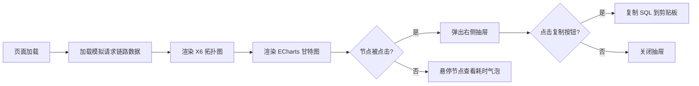

# 全链路追踪看板 - 产品需求文档 (PRD)

## 1. Product Overview

- **产品定位**：面向微服务架构运维与开发者的全链路追踪可视化看板，帮助快速定位接口卡顿根因（慢节点、慢 SQL、异常堆栈）。
- **目标用户**：后端开发工程师、SRE 运维工程师、技术负责人。
- **核心价值**：将分散的调用链信息浓缩为一张"一图读懂"的拓扑图 + 甘特图，使 2 秒以上的慢请求瓶颈一目了然。

## 2. Core Features

### 2.1 Feature Module

1. **动态调用拓扑图**：页面中央渲染 `API 网关 → 订单服务 → 库存服务 → DB` 的调用链路。
2. **瓶颈节点异常高亮**：当库存服务耗时 > 2s 时，节点变红，上游连线变为红色粗壮虚线并带流动粒子，附气泡提示。
3. **节点详情抽屉**：点击任意节点从右侧滑出抽屉，展示慢 SQL 列表（代码高亮）与调用堆栈，附"一键复制"。
4. **耗时分布甘特图**：页面底部 ECharts 甘特图展示单次请求在各服务间的耗时占比，异常段高亮。

### 2.2 Page Details

| Page Name | Module Name | Feature description |
|-----------|-------------|---------------------|
| 追踪看板主页 | 页头信息栏 | 显示请求 ID、时间戳、总耗时、状态徽章（正常/异常） |
| 追踪看板主页 | 中央拓扑图区 | X6 渲染的有向无环图，节点承载服务名称 + 耗时，边承载调用方向 |
| 追踪看板主页 | 瓶颈高亮动效 | 红色节点 + 红色流动虚线粒子边 + 悬浮气泡"库存服务响应耗时 2.4s" |
| 追踪看板主页 | 右侧详情抽屉 | 慢 SQL 代码块、Copy 按钮、堆栈信息折叠展开 |
| 追踪看板主页 | 底部甘特图 | ECharts Gantt 形式横向条形图，按时间线展示各段耗时，异常段橙红色突出 |

## 3. Core Process

用户核心操作流程：打开看板 → 一眼看到红色瓶颈节点 → 点击节点 → 阅读慢 SQL → 复制后定位代码修复。

## 4. User Interface Design

### 4.1 Design Style

- **主题色**：深色科技感（`#0B1020` 深蓝底色 + `#1E293B` 卡片灰），异常色 `#EF4444`，正常色 `#22C55E`，强调色 `#38BDF8`。
- **字体**：标题使用 `JetBrains Mono` + `Segoe UI`，正文使用系统等宽字体，强调代码可读性。
- **图标风格**：Lucide 线性图标，统一 16px 大小。
- **布局风格**：三段式布局——顶部信息栏 + 中央大图（flex: 1）+ 底部甘特图（固定高度）。
- **动效**：节点呼吸光晕 `box-shadow` pulsate，边动画 `stroke-dashoffset` 流动粒子。
- **卡片质感**：圆角 8px，细微 1px 高光边框 `rgba(59,130,246,0.18)`，深阴影 `0 8px 32px rgba(0,0,0,0.4)`。

### 4.2 Page Design Overview

| Page Name | Module Name | UI Elements |
|-----------|-------------|-------------|
| 追踪看板主页 | 页头 | 标题（左侧 icon + H1）、请求 ID Tag、时间戳、总耗时大数字、状态徽章（Pulse 动画） |
| 追踪看板主页 | 拓扑图 | X6 Canvas 容器，节点为圆角矩形（服务名 / 耗时），边为曲线箭头 |
| 追踪看板主页 | 瓶颈节点 | `fill: #EF4444`、`stroke-width: 3`、发光滤镜、悬浮 Tooltip |
| 追踪看板主页 | 瓶颈边 | `stroke: #EF4444`、`stroke-dasharray: 10 5`、`stroke-width: 4`、粒子沿边流动 |
| 追踪看板主页 | 抽屉 | Element Plus Drawer 从右侧滑出，60% 宽度，标题 + Tab（慢 SQL / 堆栈） |
| 追踪看板主页 | 甘特图 | 横向条形图，X 轴为时间轴（毫秒），Y 轴为服务名称，异常段渐变色填充 |

### 4.3 Responsiveness

- **桌面优先（≥ 1280px）**：三段式标准布局，抽屉宽度 60%。
- **中等屏幕（768–1279px）**：抽屉宽度 80%，甘特图高度自适应 320px。
- **移动（< 768px）**：纵向堆叠，抽屉全屏。
