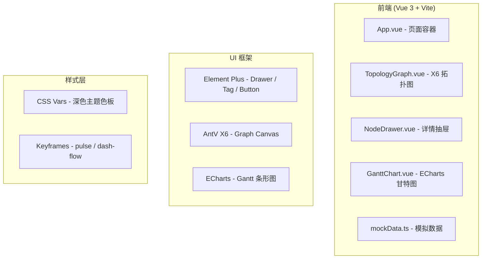

# 全链路追踪看板 - 技术架构文档

## 1. Architecture Design



## 2. Technology Description

- **前端框架**：Vue 3 (Composition API) + TypeScript + `<script setup>`
- **构建工具**：Vite 5（`npm init vite-init@latest . -- --template vue-ts`）
- **UI 组件库**：Element Plus（Drawer、ElTag、ElButton、ElTabs、ElCollapse）
- **拓扑图引擎**：`@antv/x6`（Graph + custom node + edge with marker）
- **图表库**：`echarts`（Gantt 通过 custom series 或横向 bar + stack 实现）
- **代码高亮**：`highlight.js` / `prismjs`（SQL 语法高亮）
- **样式方案**：原生 CSS + CSS 变量，非 Tailwind（深色科技主题手写更可控）
- **图标**：Lucide Vue Next (`lucide-vue-next`)

> 注：项目为纯前端 Demo，不包含后端，所有链路数据由 `src/mock/mockData.ts` 模拟。

## 3. Route Definitions

| Route | 组件 | 用途 |
|-------|------|------|
| `/` | `App.vue` → `TraceDashboard.vue` | 全链路追踪看板主页（唯一页面） |

## 4. Core Data Model (TypeScript)

```ts
interface ServiceNode {
  id: string;
  name: string;
  type: 'gateway' | 'service' | 'db';
  duration: number;        // 毫秒
  isBottleneck: boolean;    // 是否为瓶颈节点 (duration > 2000)
  slowSqls: SlowSqlItem[];
  stackTraces: StackTraceItem[];
}

interface CallEdge {
  source: string;           // 源节点 id
  target: string;           // 目标节点 id
  duration: number;
  isBottleneckPath: boolean;
}

interface SlowSqlItem {
  id: string;
  sql: string;
  duration: number;         // 毫秒
  rowsExamined: number;
  executedAt: string;
}

interface StackTraceItem {
  id: string;
  file: string;
  line: number;
  method: string;
  class: string;
}

interface TraceRequest {
  requestId: string;
  timestamp: string;
  totalDuration: number;
  status: 'normal' | 'slow';
  nodes: ServiceNode[];
  edges: CallEdge[];
}
```

## 5. X6 拓扑图渲染策略

- **Graph 配置**：`background: { color: '#0B1020' }`，`grid: false`，`interacting: false`（只读）
- **节点**：自定义 `rect` 形状，160×72，圆角 10；分两层 Label（上层服务名，下层耗时 ms）
- **节点状态映射**：
  - `normal`: fill `#1E3A5F`, stroke `#38BDF8`, stroke-width 1.5
  - `bottleneck`: fill `#7F1D1D`, stroke `#EF4444`, stroke-width 3, 外层加发光滤镜 `filter: drop-shadow(0 0 8px #EF4444)`
- **边**：`smooth: true` 曲线，`router: { name: 'manhattan' }`，箭头 marker
- **边状态映射**：
  - `normal`: stroke `#475569`, stroke-width 2, solid
  - `bottleneckPath`: stroke `#EF4444`, stroke-width 4, `dasharray: 10 5`，配合 `setInterval` 递减 `dashoffset` 产生流动粒子
- **交互**：
  - `node:click` → 打开抽屉
  - `node:mouseenter` → X6 Tooltip（自定义 HTML）显示详细耗时

## 6. ECharts 甘特图实现方案

ECharts 没有原生 Gantt，采用 **"stacked horizontal bar" 技巧**实现：

- `xAxis`: `value`，单位 ms，0 ~ 总耗时
- `yAxis`: `category`，服务名称数组
- **两个 series**：
  - series[0] = `transparent`（占位，表示 start 偏移，stack: 'total'）
  - series[1] = 实际耗时条（stack: 'total'），颜色按 `isBottleneck` 在 `#38BDF8` / `#EF4444` 间切换
- **动画**：`animationDuration: 1200`, `animationEasing: 'cubicOut'`
- **异常段**：bottleneck=true 的 bar 使用 `itemStyle.color: new echarts.graphic.LinearGradient(...)` 渐变红色

## 7. 目录结构

```
src/
├── App.vue                    # 根容器，引入 TraceDashboard
├── main.ts                    # 挂载 + Element Plus 注册
├── style.css                  # 全局深色主题 + CSS vars + keyframes
├── components/
│   ├── TraceDashboard.vue     # 主看板：页头 + 拓扑图 + 甘特图
│   ├── TopologyGraph.vue      # X6 Canvas 组件
│   ├── NodeDrawer.vue         # 右侧抽屉（Tab 切换 SQL/堆栈）
│   └── GanttChart.vue         # ECharts 甘特图
├── mock/
│   └── mockData.ts            # 模拟链路数据
└── types/
    └── trace.ts               # TypeScript 类型定义
```

## 8. 关键交互事件流

1. **加载** → `onMounted` 中 `mockTrace = buildMockTrace()` → 传入子组件
2. **拓扑图节点点击** → `emit('node-click', node)` → 父组件 `selectedNode = node` → 抽屉 `visible=true`
3. **复制 SQL** → `navigator.clipboard.writeText(sql)` → Element Plus `ElMessage` 提示
4. **窗口 resize** → `graph.resize()` + `chart.resize()`
5. **边流动粒子** → `setInterval` 每 50ms 递减瓶颈边 `style/stroke/dashoffset`，数值循环到 0 重置为 15

## 9. 性能与降级策略

- X6 节点 ≤ 10 个，无虚拟化压力
- `setInterval` 在 `onBeforeUnmount` 中 `clearInterval`
- Canvas 渲染只做一次初始化，数据变更用 `graph.fromJSON()` 增量更新
- 低性能模式（如检测到移动设备）关闭粒子流，只保留变色

## 10. 依赖清单 (package.json)

```json
{
  "dependencies": {
    "vue": "^3.4.0",
    "element-plus": "^2.5.0",
    "@antv/x6": "^2.18.0",
    "echarts": "^5.5.0",
    "highlight.js": "^11.9.0",
    "lucide-vue-next": "^0.344.0"
  }
}
```
