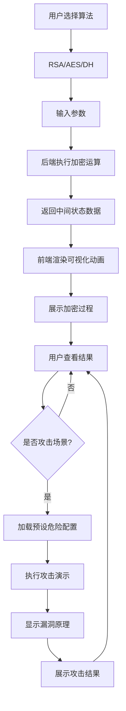

# 加密算法可视化教学工具 - 产品需求文档

## 1. 产品概述

深入演示经典与现代加密算法内部运作机制的教学工具，帮助用户直观理解 RSA、AES、Diffie-Hellman 等算法的核心数学运算过程，以及常见安全漏洞的形成原理与攻击方式。

- **核心用途**：通过可视化动画展示大整数运算、模幂操作、有限域运算等加密核心步骤
- **目标用户**：计算机安全专业学生、密码学爱好者、Web 安全研究人员
- **市场价值**：填补传统密码学教学偏重理论、缺乏交互式可视化工具的空白

## 2. 核心功能

### 2.1 算法支持模块

| 算法类型 | 支持功能 |
|---------|---------|
| **RSA** | 密钥生成（素数 p/q 选择）、加密/解密、签名验证、小模数分解攻击 |
| **AES** | 密钥扩展、字节代换(SubBytes)、行移位(ShiftRows)、列混淆(MixColumns)、轮密钥加(AddRoundKey)、弱密钥攻击场景 |
| **Diffie-Hellman** | 素数域选择、G 生成元协商、密钥交换可视化、中间人攻击场景 |

### 2.2 预设攻击场景

| 场景名称 | 描述 | 可视化重点 |
|---------|------|-----------|
| RSA 小模数分解 | 使用小素数(p/q<2^32)导致私钥可被轻易分解 | 埃拉托斯特尼筛网动画 + 质因数分解闪烁 |
| AES 弱密钥攻击 | 使用重复密钥模式导致相关密钥攻击可行 | 密钥扩展树状分支 + 模式泄露热力图 |
| 中间人攻击拦截 | DH 交换过程中攻击者劫持公钥 | 数据包拦截动画 + 伪造签名闪烁 |
| 填充预言机攻击 | CBC 模式 padding 校验泄漏信息 | 粒子搅拌扩散动画 + 错误信息弹窗 |

### 2.3 数据存储

- **实验记录**：保存用户的加密/解密操作历史
- **自定义密钥对**：存储用户生成的 RSA/DH 密钥对
- **预设场景配置**：快速加载存在安全隐患的加密配置

### 2.4 动画效果

| 动画类型 | 应用场景 | 技术实现 |
|---------|---------|---------|
| 比特位翻转闪烁 | 数据修改、校验过程 | Canvas 粒子 + CSS keyframes |
| 轮函数流水线推进 | AES 多轮处理流程 | SVG 流式动画 |
| 素数筛选筛网过滤 | RSA 素数选择过程 | D3.js 筛选动画 |
| 密钥扩展树状分支 | 密钥调度可视化 | 递归 SVG 树 |
| 数据混淆扩散粒子搅拌 | 雪崩效应展示 | WebGL 粒子系统 |

## 3. 核心流程

### 3.1 加密演示主流程

```
用户选择算法 → 输入明文/密钥 → 后端执行运算 → 前端动画展示 → 结果输出
```

### 3.2 攻击场景加载流程

```
点击预设按钮 → 加载危险配置 → 执行攻击演示 → 展示漏洞原理 → 显示攻击结果
```

### 3.3 流程图



## 4. 用户界面设计

### 4.1 设计风格

- **主题**：赛博朋克 + 技术终端美学
- **主色调**：深空黑 #0a0e17、霓虹青 #00fff2、电离紫 #bf00ff、警告橙 #ff6b35
- **字体**：
  - 标题：JetBrains Mono（等宽技术风格）
  - 正文：Source Han Sans CN（中文支持）
- **布局**：左右分栏（算法控制区 | 可视化展示区）
- **按钮风格**：霓虹边框 + 发光效果
- **交互**：hover 时元素发光脉动

### 4.2 页面结构

| 区域 | 内容 |
|-----|------|
| 顶部导航 | 算法选择标签页、预设攻击场景按钮 |
| 左侧控制区 | 参数输入表单、密钥生成、加密/解密按钮 |
| 右侧可视化区 | Canvas/SVG 动画展示区 |
| 底部状态栏 | 运算进度、中间值显示区 |

### 4.3 响应式策略

- **桌面端（≥1200px）**：左右分栏，动画全尺寸展示
- **平板端（768-1199px）**：上下布局，动画缩放
- **移动端（<768px）**：简化动画，手风琴式交互

### 4.4 可视化元素

| 元素类型 | 样式特征 |
|---------|---------|
| 比特网格 | 8×N 矩阵，每个格子代表一比特，0=暗色，1=亮色 |
| 流水线管道 | 水平箭头流，节点表示轮函数 |
| 素数筛网 | 网格背景 + 交叉线标记 |
| 密钥树 | 垂直树状图，分支颜色区分密钥轮次 |
| 粒子系统 | 半透明圆形，颜色渐变表示状态变化 |

## 5. 技术约束

- 前端使用 Vue 3 Composition API
- 后端使用 Fastify 处理 API 请求
- SQLite (sql.js) 存储于浏览器端
- 所有加密运算在后端执行，前端仅负责展示
- 动画帧率目标：60fps（高性能场景 30fps 降级）
