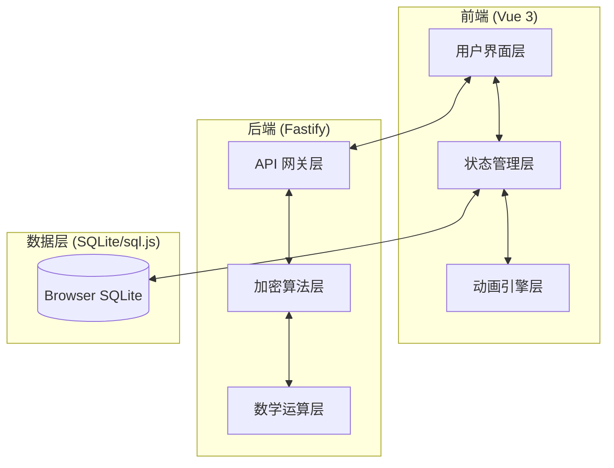
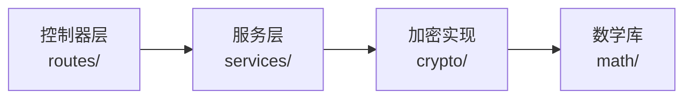
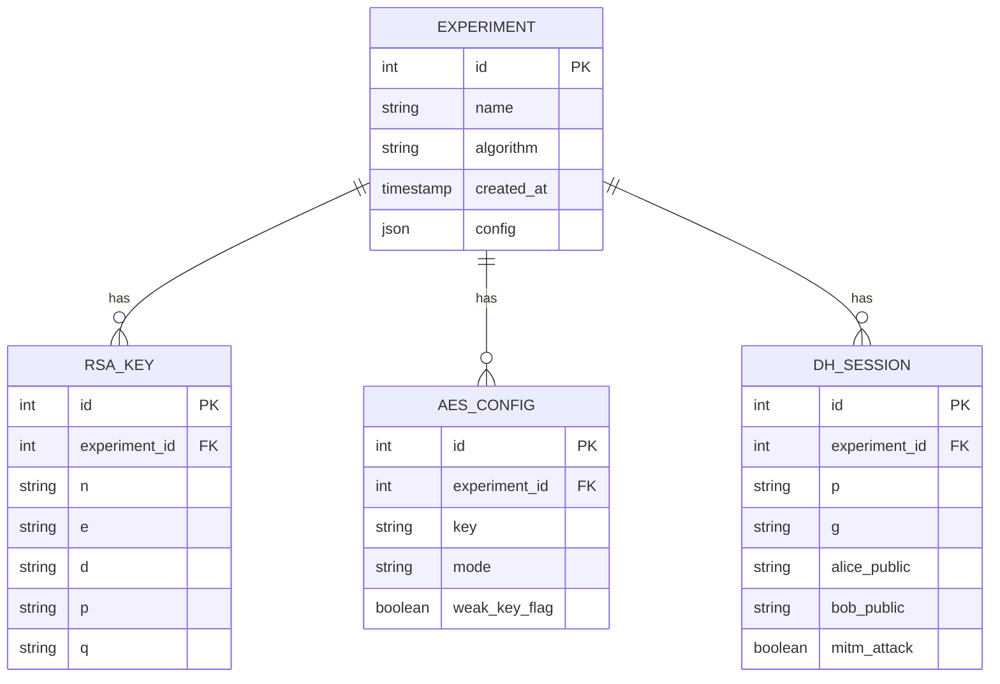

# 加密算法可视化教学工具 - 技术架构文档

## 1. 架构设计



## 2. 技术选型

| 层级 | 技术选型 | 版本 |
|-----|---------|------|
| 前端框架 | Vue 3 | 3.4+ |
| 构建工具 | Vite | 5.x |
| 后端框架 | Fastify | 4.x |
| 数据库 | sql.js | 1.8+ |
| 数学库 | big-integer | 1.6+ |
| 动画库 | Canvas API + SVG | 原生 |
| 状态管理 | Pinia | 2.x |

## 3. 路由定义

| 路由 | 方法 | 描述 |
|-----|------|------|
| `/api/crypto/rsa/generate` | POST | 生成 RSA 密钥对 |
| `/api/crypto/rsa/encrypt` | POST | RSA 加密 |
| `/api/crypto/rsa/decrypt` | POST | RSA 解密 |
| `/api/crypto/rsa/factor` | POST | 小模数分解攻击 |
| `/api/crypto/aes/encrypt` | POST | AES 加密 |
| `/api/crypto/aes/decrypt` | POST | AES 解密 |
| `/api/crypto/dh/generate` | POST | 生成 DH 参数 |
| `/api/crypto/dh/key-exchange` | POST | DH 密钥交换 |
| `/api/crypto/dh/mitm` | POST | 中间人攻击演示 |
| `/api/records/save` | POST | 保存实验记录 |
| `/api/records/list` | GET | 获取实验记录列表 |
| `/api/records/delete/:id` | DELETE | 删除实验记录 |

## 4. API 定义

### 4.1 RSA 加密请求/响应

```typescript
// Request
interface RSAEncryptRequest {
  plaintext: string;
  publicKey: {
    n: string;  // 大整数字符串
    e: string;  // 公开指数
  };
  operation: 'encrypt' | 'decrypt';
}

// Response
interface RSAEncryptResponse {
  ciphertext: string;
  steps: Array<{
    type: 'mod-exp' | 'byteswap';
    input: string;
    output: string;
    duration: number;
  }>;
}
```

### 4.2 AES 加密请求/响应

```typescript
// Request
interface AESEncryptRequest {
  plaintext: string;  // 16字节 hex
  key: string;         // 16/24/32字节 hex
  mode: 'ECB' | 'CBC' | 'CTR';
  rounds: number;     // 10/12/14
}

// Response
interface AESEncryptResponse {
  ciphertext: string;
  keySchedule: Array<{
    round: number;
    roundKey: string;
  }>;
  stateEvolution: Array<{
    round: number;
    subBytes: string;
    shiftRows: string;
    mixColumns?: string;
    addRoundKey: string;
  }>;
}
```

### 4.3 Diffie-Hellman 攻击响应

```typescript
interface DHAttackResponse {
  p: string;           // 素数
  g: string;           // 生成元
  alicePublic: string;
  bobPublic: string;
  mitmPublicAlice: string;
  mitmPublicBob: string;
  attackerDerivedKey: string;
  attackDescription: string;
}
```

## 5. 服务端架构



### 5.1 目录结构

```
backend/
├── routes/
│   ├── rsa.js
│   ├── aes.js
│   ├── dh.js
│   └── records.js
├── services/
│   ├── rsaService.js
│   ├── aesService.js
│   ├── dhService.js
│   └── recordsService.js
├── crypto/
│   ├── bigInteger.js
│   ├── rsaCore.js
│   ├── aesCore.js
│   └── dhCore.js
└── math/
    ├── modular.js
    ├── prime.js
    └── finiteField.js
```

## 6. 数据模型

### 6.1 ER 图



### 6.2 DDL 语句

```sql
CREATE TABLE IF NOT EXISTS experiments (
    id INTEGER PRIMARY KEY AUTOINCREMENT,
    name TEXT NOT NULL,
    algorithm TEXT NOT NULL,
    config TEXT,
    created_at DATETIME DEFAULT CURRENT_TIMESTAMP
);

CREATE TABLE IF NOT EXISTS rsa_keys (
    id INTEGER PRIMARY KEY AUTOINCREMENT,
    experiment_id INTEGER,
    n TEXT,
    e TEXT,
    d TEXT,
    p TEXT,
    q TEXT,
    FOREIGN KEY (experiment_id) REFERENCES experiments(id)
);

CREATE TABLE IF NOT EXISTS aes_configs (
    id INTEGER PRIMARY KEY AUTOINCREMENT,
    experiment_id INTEGER,
    key TEXT,
    mode TEXT,
    weak_key_flag INTEGER DEFAULT 0,
    FOREIGN KEY (experiment_id) REFERENCES experiments(id)
);

CREATE TABLE IF NOT EXISTS dh_sessions (
    id INTEGER PRIMARY KEY AUTOINCREMENT,
    experiment_id INTEGER,
    p TEXT,
    g TEXT,
    alice_public TEXT,
    bob_public TEXT,
    mitm_attack INTEGER DEFAULT 0,
    FOREIGN KEY (experiment_id) REFERENCES experiments(id)
);
```

## 7. 前端目录结构

```
frontend/
├── src/
│   ├── components/
│   │   ├── CryptoPanel/
│   │   │   ├── RSAControl.vue
│   │   │   ├── AESControl.vue
│   │   │   └── DHControl.vue
│   │   ├── Visualization/
│   │   │   ├── BitGrid.vue
│   │   │   ├── PipelineFlow.vue
│   │   │   ├── PrimeSieve.vue
│   │   │   ├── KeyTree.vue
│   │   │   └── ParticleMixer.vue
│   │   └── AttackScenarios/
│   │       ├── RSASmallFactor.vue
│   │       ├── AESWeakKey.vue
│   │       ├── DHMitm.vue
│   │       └── PaddingOracle.vue
│   ├── stores/
│   │   └── crypto.js
│   ├── views/
│   │   └── MainView.vue
│   └── App.vue
```

## 8. 安全注意事项

- 所有加密运算在后端执行，前端不暴露密钥
- sql.js 数据库仅存储于浏览器本地
- 预设攻击场景为教学目的，不包含真实恶意代码
- 素数生成使用确定性算法，攻击场景使用已知弱参数
