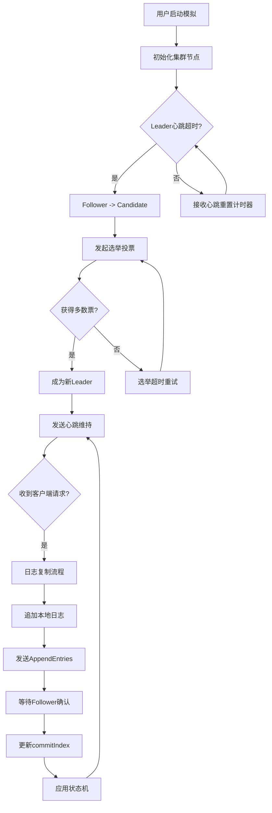

# 分布式一致性协议教学平台 - 产品需求文档 (PRD)

## 1. 产品概述

一个直观演示 Raft 分布式一致性协议运作流程的交互式教学平台，帮助用户深入理解分布式系统中的 Leader 选举、日志复制、心跳机制以及各种故障场景下的系统行为。目标用户为计算机科学学生、分布式系统学习者和软件工程师。

## 2. 核心功能

### 2.1 用户角色

| 角色 | 访问方式 | 核心权限 |
|------|----------|----------|
| 学习者 | 无需注册 | 配置集群参数、启动模拟、观察动画、查看事件时间线 |
| 演示者 | 无需注册 | 使用预设场景、控制模拟速度、暂停/继续模拟 |

### 2.2 功能模块

1. **控制面板页面**: 集群配置、预设场景按钮、模拟控制
2. **可视化主页面**: 节点状态展示、网络拓扑、消息传递动画
3. **事件时间线页面**: 历史事件记录、日志条目详情、状态变更追踪

### 2.3 页面详情

| 页面名称 | 模块名称 | 功能描述 |
|----------|----------|----------|
| 控制面板 | 集群配置区 | 设置节点数量(3-9)、网络延迟范围、故障概率 |
| 控制面板 | 预设场景区 | 四个预设按钮：网络分区脑裂、Leader频繁崩溃、日志不一致强制覆盖、消息严重乱序延迟 |
| 控制面板 | 模拟控制区 | 启动/暂停/重置按钮、速度调节滑块 |
| 可视化主页 | 节点状态区 | 显示每个节点的状态(Follower/Candidate/Leader)、当前任期、日志索引 |
| 可视化主页 | 网络拓扑区 | 节点间连线、消息传递动画、网络分区可视化 |
| 可视化主页 | 投票票箱区 | 选举时显示票数统计动画 |
| 可视化主页 | 日志复制区 | 显示日志条目的流水线传输动画 |
| 可视化主页 | 心跳倒计时区 | 显示心跳超时的倒计时闪烁 |
| 事件时间线 | 事件列表区 | 按时间顺序显示所有事件 |
| 事件时间线 | 日志详情区 | 显示每个节点的本地日志状态 |
| 事件时间线 | 异常提示区 | 高亮显示异常或边界情况 |

## 3. 核心流程

### 3.1 正常选举流程

用户启动模拟后，系统自动初始化集群节点。当 Leader 心跳超时，Follower 转变为 Candidate 并发起选举。Candidate 向其他节点发送投票请求，收集投票响应。获得多数票后成为新 Leader，开始发送心跳维持领导地位。

### 3.2 日志复制流程

客户端发送写请求到 Leader，Leader 将日志条目追加到本地日志，并行发送 AppendEntries RPC 到所有 Follower。Follower 确认后，Leader 更新 commitIndex 并通知 Follower 应用日志到状态机。

### 3.3 故障场景流程

用户点击预设场景按钮，系统自动配置相应的故障参数。模拟过程中实时展示异常现象，如网络分区导致的选举失败、旧 Leader 未退位的数据冲突等。

### 3.4 流程图

## 4. 用户界面设计

### 4.1 设计风格

- **主色调**: 深色科技风背景 (#0a0a0f)，配合霓虹蓝 (#00d4ff)、霓虹绿 (#00ff88)、霓虹红 (#ff3366) 作为状态指示色
- **按钮风格**: 圆角玻璃态按钮，带有微妙的发光边框
- **字体**: 标题使用 Orbitron (科技感)，正文使用 JetBrains Mono (等宽编程风格)
- **布局风格**: 左侧控制面板 + 中央可视化区域 + 右侧事件时间线
- **图标风格**: Lucide 图标库，线条简洁

### 4.2 页面设计概览

| 页面名称 | 模块名称 | UI元素 |
|----------|----------|--------|
| 控制面板 | 集群配置区 | 滑块控件、数字输入框、标签 |
| 控制面板 | 预设场景区 | 四个醒目的场景按钮，带图标和描述 |
| 控制面板 | 模拟控制区 | 播放/暂停/重置按钮、速度滑块 |
| 可视化主页 | 节点状态区 | 圆形节点图标、状态颜色呼吸动画、任期/索引标签 |
| 可视化主页 | 网络拓扑区 | SVG连线、消息气泡动画、断裂特效 |
| 可视化主页 | 投票票箱区 | 票数计数器、进度条动画 |
| 可视化主页 | 日志复制区 | 流水线动画、日志条目卡片 |
| 可视化主页 | 心跳倒计时区 | 圆形倒计时器、闪烁动画 |
| 事件时间线 | 事件列表区 | 时间轴、事件卡片、类型标签 |
| 事件时间线 | 日志详情区 | 表格展示、差异高亮 |
| 事件时间线 | 异常提示区 | 警告卡片、红色边框高亮 |

### 4.3 响应式设计

- 桌面优先设计，最小支持 1280px 宽度
- 平板设备：控制面板折叠为抽屉式
- 移动设备：单列布局，时间线折叠

### 4.4 动画设计规范

| 动画类型 | 描述 | 技术实现 |
|----------|------|----------|
| 票箱计数动画 | 票数从0递增到最终值，带数字滚动效果 | CSS animation + JS计数器 |
| 日志同步流水线 | 日志条目从Leader流向Follower的动画 | CSS keyframes + SVG路径动画 |
| 状态颜色呼吸 | Follower(蓝)、Candidate(黄)、Leader(绿)的渐变呼吸 | CSS box-shadow + opacity动画 |
| 心跳倒计时闪烁 | 倒计时接近0时加速闪烁 | CSS animation + JS定时器 |
| 网络断裂特效 | 连线从中间断开、粒子消散效果 | CSS clip-path + Canvas粒子 |

## 5. 异常场景详细说明

### 5.1 网络分区脑裂场景

- **配置**: 将节点分为两个分区，每个分区无法与另一个分区通信
- **预期现象**: 两个分区各自选举Leader，产生双主现象
- **教学要点**: 展示为什么需要多数派投票机制

### 5.2 Leader节点频繁崩溃场景

- **配置**: Leader节点每隔固定时间自动崩溃
- **预期现象**: 集群频繁进行选举，服务不稳定
- **教学要点**: 展示选举超时随机化的重要性

### 5.3 日志不一致强制覆盖场景

- **配置**: 部分节点日志落后或冲突
- **预期现象**: Leader强制覆盖Follower的冲突日志
- **教学要点**: 展示Raft的日志匹配和一致性检查机制

### 5.4 消息严重乱序延迟场景

- **配置**: 消息延迟时间随机且可能乱序到达
- **预期现象**: 日志复制效率下降，可能触发不必要的选举
- **教学要点**: 展示Raft对网络异常的容错能力
