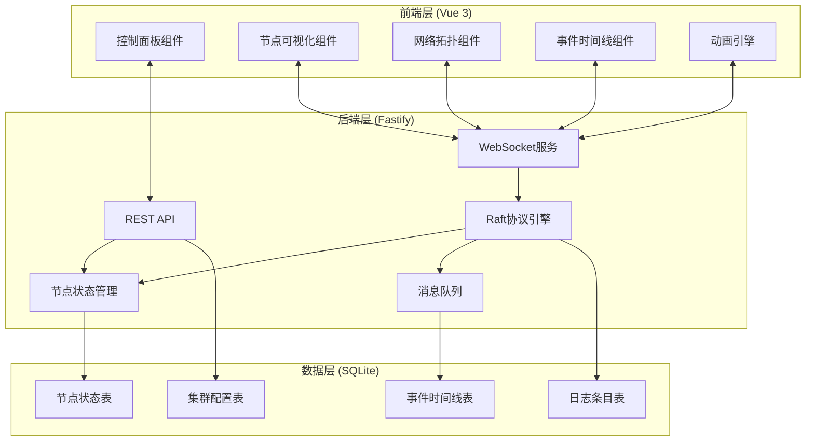
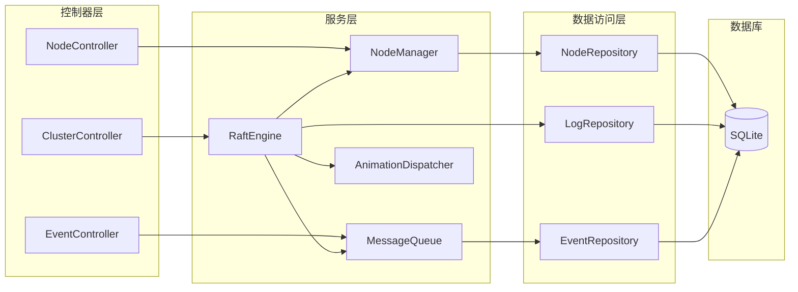
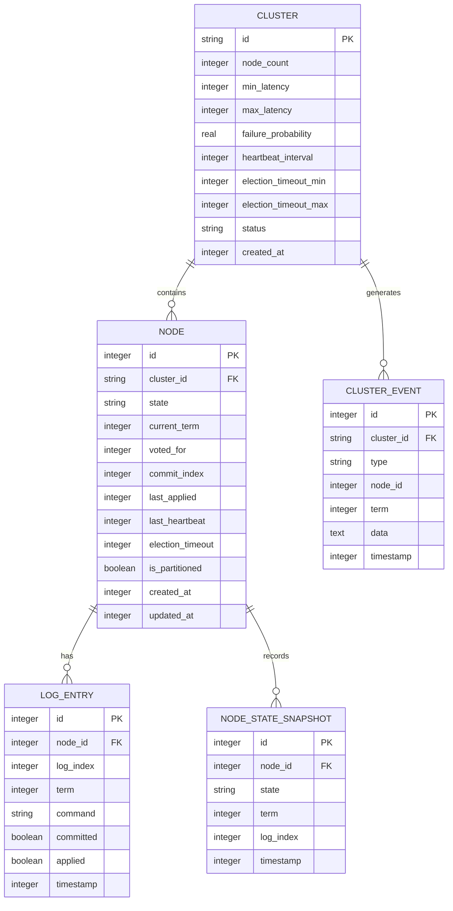
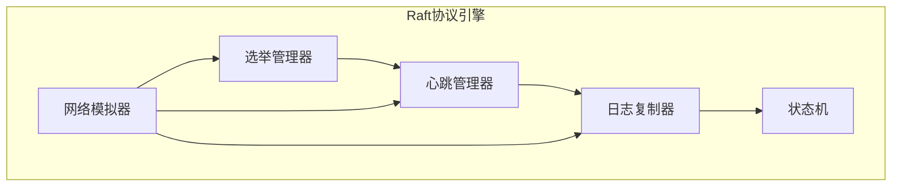

# 分布式一致性协议教学平台 - 技术架构文档

## 1. 架构设计



## 2. 技术栈说明

- **前端**: Vue 3 + TypeScript + Tailwind CSS + Vite
- **后端**: Fastify + TypeScript (ESM格式)
- **数据库**: SQLite (better-sqlite3)
- **实时通信**: WebSocket (fastify-websocket)
- **初始化工具**: vite-init (vue-express-ts模板，后替换Express为Fastify)

## 3. 路由定义

### 3.1 前端路由

| 路由 | 用途 |
|------|------|
| `/` | 主页面，包含控制面板和可视化区域 |
| `/timeline` | 事件时间线页面 |
| `/logs` | 日志详情页面 |

### 3.2 后端API路由

| 路由 | 方法 | 用途 |
|------|------|------|
| `/api/cluster` | POST | 创建/重置集群 |
| `/api/cluster/config` | PUT | 更新集群配置 |
| `/api/cluster/start` | POST | 启动模拟 |
| `/api/cluster/pause` | POST | 暂停模拟 |
| `/api/cluster/reset` | POST | 重置模拟 |
| `/api/scenario/:name` | POST | 加载预设场景 |
| `/api/nodes` | GET | 获取所有节点状态 |
| `/api/nodes/:id` | GET | 获取单个节点详情 |
| `/api/nodes/:id/crash` | POST | 手动崩溃节点 |
| `/api/nodes/:id/restart` | POST | 重启节点 |
| `/api/logs` | GET | 获取所有日志条目 |
| `/api/events` | GET | 获取事件时间线 |
| `/ws` | WebSocket | 实时状态推送 |

## 4. API定义

### 4.1 类型定义

```typescript
// 节点状态枚举
enum NodeState {
  FOLLOWER = 'follower',
  CANDIDATE = 'candidate',
  LEADER = 'leader',
  DEAD = 'dead'
}

// 节点信息
interface Node {
  id: number;
  state: NodeState;
  currentTerm: number;
  votedFor: number | null;
  commitIndex: number;
  lastApplied: number;
  nextIndex: number[];
  matchIndex: number[];
  lastHeartbeat: number;
  electionTimeout: number;
  isPartitioned: boolean;
}

// 日志条目
interface LogEntry {
  index: number;
  term: number;
  command: string;
  timestamp: number;
  nodeId: number;
}

// 事件类型
interface ClusterEvent {
  id: number;
  type: 'election' | 'vote' | 'heartbeat' | 'log_replication' | 'state_change' | 'network_partition' | 'crash' | 'recovery';
  nodeId: number;
  term: number;
  data: Record<string, unknown>;
  timestamp: number;
}

// 集群配置
interface ClusterConfig {
  nodeCount: number;
  minLatency: number;
  maxLatency: number;
  failureProbability: number;
  heartbeatInterval: number;
  electionTimeoutMin: number;
  electionTimeoutMax: number;
}

// 预设场景
interface PresetScenario {
  name: string;
  config: ClusterConfig;
  partitions: number[][];
  crashSchedule: { nodeId: number; delay: number }[];
  messageDelay: { min: number; max: number; disorderRate: number };
}
```

### 4.2 请求/响应模式

```typescript
// 创建集群请求
interface CreateClusterRequest {
  nodeCount: number;
  config?: Partial<ClusterConfig>;
}

// 创建集群响应
interface CreateClusterResponse {
  clusterId: string;
  nodes: Node[];
}

// WebSocket消息
interface WSMessage {
  type: 'state_update' | 'new_event' | 'log_update' | 'animation_trigger';
  payload: unknown;
}
```

## 5. 服务端架构图



## 6. 数据模型

### 6.1 实体关系图



### 6.2 数据定义语言 (DDL)

```sql
-- 集群表
CREATE TABLE IF NOT EXISTS cluster (
    id TEXT PRIMARY KEY,
    node_count INTEGER NOT NULL DEFAULT 5,
    min_latency INTEGER NOT NULL DEFAULT 50,
    max_latency INTEGER NOT NULL DEFAULT 200,
    failure_probability REAL NOT NULL DEFAULT 0.0,
    heartbeat_interval INTEGER NOT NULL DEFAULT 150,
    election_timeout_min INTEGER NOT NULL DEFAULT 300,
    election_timeout_max INTEGER NOT NULL DEFAULT 600,
    status TEXT NOT NULL DEFAULT 'idle',
    created_at INTEGER NOT NULL
);

-- 节点表
CREATE TABLE IF NOT EXISTS node (
    id INTEGER PRIMARY KEY AUTOINCREMENT,
    cluster_id TEXT NOT NULL,
    state TEXT NOT NULL DEFAULT 'follower',
    current_term INTEGER NOT NULL DEFAULT 0,
    voted_for INTEGER,
    commit_index INTEGER NOT NULL DEFAULT 0,
    last_applied INTEGER NOT NULL DEFAULT 0,
    last_heartbeat INTEGER NOT NULL,
    election_timeout INTEGER NOT NULL,
    is_partitioned INTEGER NOT NULL DEFAULT 0,
    created_at INTEGER NOT NULL,
    updated_at INTEGER NOT NULL,
    FOREIGN KEY (cluster_id) REFERENCES cluster(id)
);

-- 日志条目表
CREATE TABLE IF NOT EXISTS log_entry (
    id INTEGER PRIMARY KEY AUTOINCREMENT,
    node_id INTEGER NOT NULL,
    log_index INTEGER NOT NULL,
    term INTEGER NOT NULL,
    command TEXT NOT NULL,
    committed INTEGER NOT NULL DEFAULT 0,
    applied INTEGER NOT NULL DEFAULT 0,
    timestamp INTEGER NOT NULL,
    FOREIGN KEY (node_id) REFERENCES node(id),
    UNIQUE(node_id, log_index)
);

-- 节点状态快照表
CREATE TABLE IF NOT EXISTS node_state_snapshot (
    id INTEGER PRIMARY KEY AUTOINCREMENT,
    node_id INTEGER NOT NULL,
    state TEXT NOT NULL,
    term INTEGER NOT NULL,
    log_index INTEGER NOT NULL,
    timestamp INTEGER NOT NULL,
    FOREIGN KEY (node_id) REFERENCES node(id)
);

-- 集群事件表
CREATE TABLE IF NOT EXISTS cluster_event (
    id INTEGER PRIMARY KEY AUTOINCREMENT,
    cluster_id TEXT NOT NULL,
    type TEXT NOT NULL,
    node_id INTEGER,
    term INTEGER NOT NULL,
    data TEXT NOT NULL,
    timestamp INTEGER NOT NULL,
    FOREIGN KEY (cluster_id) REFERENCES cluster(id)
);

-- 索引
CREATE INDEX IF NOT EXISTS idx_node_cluster ON node(cluster_id);
CREATE INDEX IF NOT EXISTS idx_log_node ON log_entry(node_id);
CREATE INDEX IF NOT EXISTS idx_log_index ON log_entry(node_id, log_index);
CREATE INDEX IF NOT EXISTS idx_event_cluster ON cluster_event(cluster_id);
CREATE INDEX IF NOT EXISTS idx_event_time ON cluster_event(timestamp);
CREATE INDEX IF NOT EXISTS idx_snapshot_node ON node_state_snapshot(node_id);
```

## 7. Raft协议引擎设计

### 7.1 核心组件



### 7.2 关键算法

#### 选举超时随机化
```typescript
function getRandomElectionTimeout(min: number, max: number): number {
    return Math.floor(Math.random() * (max - min + 1)) + min;
}
```

#### 日志匹配检查
```typescript
function checkLogMatch(leaderLog: LogEntry[], followerLog: LogEntry[], prevLogIndex: number, prevLogTerm: number): boolean {
    if (prevLogIndex < 0) return true;
    if (prevLogIndex >= followerLog.length) return false;
    return followerLog[prevLogIndex].term === prevLogTerm;
}
```

#### 多数派投票判断
```typescript
function hasMajority(votes: number, totalNodes: number): boolean {
    return votes > Math.floor(totalNodes / 2);
}
```

## 8. 动画系统设计

### 8.1 动画事件类型

| 事件类型 | 触发条件 | 动画效果 |
|----------|----------|----------|
| `election_start` | Follower变为Candidate | 节点颜色变黄、开始闪烁 |
| `vote_cast` | 节点投票 | 票数计数器递增动画 |
| `election_win` | 获得多数票 | 节点颜色变绿、发送心跳射线 |
| `heartbeat_send` | Leader发送心跳 | 心跳波纹从Leader扩散 |
| `log_replicate` | 日志复制 | 日志条目沿连线流动 |
| `state_change` | 状态切换 | 颜色渐变呼吸动画 |
| `network_partition` | 网络分区 | 连线断裂、粒子消散 |
| `node_crash` | 节点崩溃 | 节点变灰、下沉消失 |
| `node_recovery` | 节点恢复 | 节点渐显、上升出现 |

### 8.2 WebSocket消息格式

```typescript
interface AnimationEvent {
    type: AnimationEventType;
    sourceNodeId?: number;
    targetNodeId?: number;
    data: Record<string, unknown>;
    duration: number;
}
```
