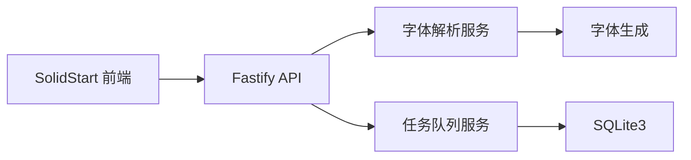
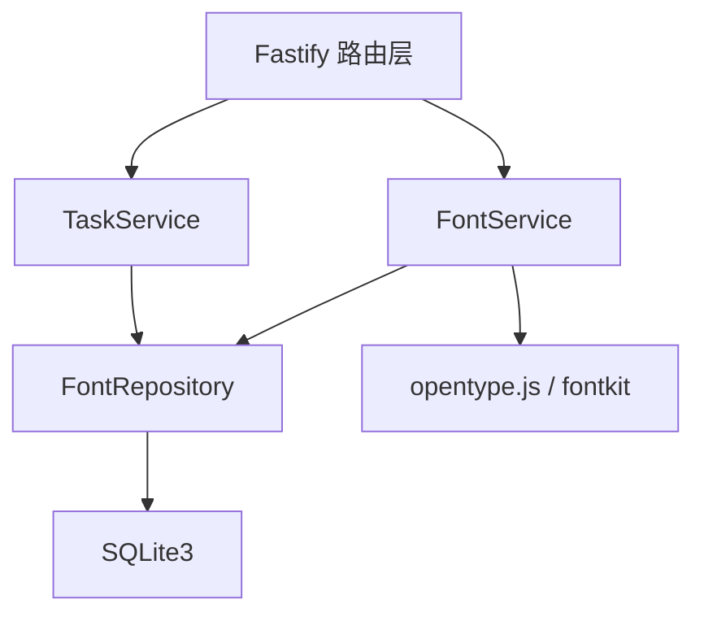
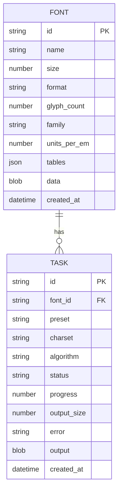

## 1. 架构设计



## 2. 技术说明

- 前端：SolidStart@1（SolidJS 全栈框架）+ TypeScript
- 后端：Fastify@4 + @fastify/multipart + @fastify/cors
- 字体处理：opentype.js（解析/生成 TTF/OTF）、fontkit（读取 cmap/glyf）、wawoff2（WOFF2 压缩）
- 数据库：better-sqlite3（同步 API）
- 样式：TailwindCSS + 自定义 CSS 动画
- 动画：Motion（Solid）+ SVG 动画
- 构建：Vite + SolidStart SSR

## 3. 路由定义

| 路由 | 用途 |
|------|------|
| / | 工作台主界面（SolidStart 页面） |
| /api/upload | 上传字体文件 |
| /api/fonts/:id/process | 处理字体（子集化/预设） |
| /api/fonts/:id | 获取字体元数据 |
| /api/tasks | 任务列表 |
| /api/tasks/:id | 任务详情与下载 |
| /api/presets | 预设配置列表 |

## 4. API 定义

```ts
// POST /api/upload
Req: multipart/form-data { file: Buffer }
Res: { id, name, size, format, glyphs, family, unitsPerEm, tables }

POST /api/fonts/:id/process
Req: { charset: string, preset?: 'cn' | 'icon' | 'corrupt' | 'merge',
       algorithm: 'subset' | 'repair' | 'merge', checksum: boolean }
Res: { taskId }

GET /api/fonts/:id
Res: { id, name, size, format, glyphCount, tables: { cmap, glyf, head, ... } }

GET /api/tasks
Res: [{ id, fontId, status, progress, createdAt }]

GET /api/tasks/:id
Res: { id, status, progress, outputSize, error?, outputUrl? }
```

## 5. 服务端架构图



## 6. 数据模型

### 6.1 数据模型定义



### 6.2 DDL

```sql
CREATE TABLE fonts (
  id TEXT PRIMARY KEY,
  name TEXT NOT NULL,
  size INTEGER NOT NULL,
  format TEXT NOT NULL,
  glyph_count INTEGER,
  family TEXT,
  units_per_em INTEGER,
  tables TEXT,
  data BLOB NOT NULL,
  created_at TEXT DEFAULT (datetime('now'))
);
CREATE INDEX idx_fonts_name ON fonts(name);

CREATE TABLE tasks (
  id TEXT PRIMARY KEY,
  font_id TEXT NOT NULL,
  preset TEXT,
  charset TEXT,
  algorithm TEXT,
  status TEXT NOT NULL,
  progress INTEGER DEFAULT 0,
  output_size INTEGER,
  error TEXT,
  output BLOB,
  created_at TEXT DEFAULT (datetime('now')),
  FOREIGN KEY (font_id) REFERENCES fonts(id)
);
CREATE INDEX idx_tasks_font ON tasks(font_id);
```
