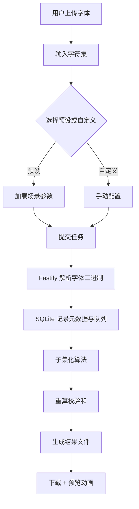

## 1. 产品概述
基于 SolidStart + Fastify + SQLite3 的 Web 字体文件在线处理工具，支持 TTF/OTF/WOFF2 上传、字符集筛选、子集化生成以及多场景预设。目标是为前端开发者与字体爱好者提供一个可观察字体二进制结构、可视化处理过程的交互式工具。

- 核心问题：中文字体文件体积过大、图标字体提取不透明、损坏字体抢救、多字体合并处理。
- 价值：提供可观察字形预览动画与异常场景（乱码、校验错误、空字符集、超大字体 OOM）可视化。

## 2. 核心功能

### 2.1 用户角色

| 角色 | 注册方式 | 核心权限 |
|------|----------|----------|
| 匿名用户 | 无需注册 | 上传字体、输入字符集、触发处理、下载结果、使用预设场景 |

### 2.2 功能模块

1. **工作台（Workbench）：上传、字符集输入、参数配置、任务提交、预设场景加载。
2. **预览与动画区：字形矢量路径绘制动画、环形进度、网格筛选动画、数字滚动动画、故障干扰动画。
3. **任务面板：任务队列、状态流转、元数据展示。

### 2.3 页面详情

| 页面 | 模块 | 功能描述 |
|------|------|----------|
| 工作台 | 上传区 | 拖拽上传 TTF/OTF/WOFF2，显示元数据 |
| 工作台 | 字符集输入 | 输入/粘贴字符集，提供网格筛选动画 |
| 工作台 | 处理参数 | 格式选择、子集化算法选择、是否重新计算校验和 |
| 工作台 | 预设按钮 | 中文字体精简、图标字体提取、损坏字体修复、多字体合并 |
| 工作台 | 预览画布 | SVG 矢量路径绘制动画，实时观察乱码/损坏场景 |
| 工作台 | 进度圆环 | 环形加载动画展示处理进度 |
| 工作台 | 体积数字滚动 | 体积变化数字滚动动画 |
| 工作台 | 错误提示 | 故障干扰动画 |
| 任务面板 | 队列 | 任务列表、状态、结果下载、元数据 |

## 3. 核心流程

用户上传字体→输入字符集→选择预设或自定义→后端解析 cmap/glyf→执行子集化→重新计算校验和→生成新字体→下载。

## 4. 用户界面设计

### 4.1 设计风格
- 主色：深色工业风（#0b0d12 背景 + #00ffa3 荧光绿 + #ff2d6e 故障红）
- 辅色：#6b7280 灰阶
- 按钮：胶囊形、荧光描边、悬停发光
- 字体：主体使用系统等宽 + 标题使用现代衬线/等宽混合
- 布局：卡片堆叠 + 栅格 + 浮动预览画布居中
- 图标：线性简洁几何图标

### 4.2 页面设计概览

| 页面 | 模块 | UI 要素 |
|------|------|---------|
| 工作台 | 上传区 | 虚线拖拽 + 拖入高亮 + 文件信息 |
| 工作台 | 字符集 | 文本域 + 网格动画筛选动画 |
| 工作台 | 预设按钮 | 四色胶囊按钮、点击场景加载 |
| 工作台 | 预览画布 | SVG 实时绘制 |
| 工作台 | 进度 | 环形 loading |
| 工作台 | 体积数字 | 滚动动画 |
| 工作台 | 错误 | 故障干扰动画（glitch） |

### 4.3 响应式
桌面端优先，1400px 宽布局，平板与移动端自适应栅格。
